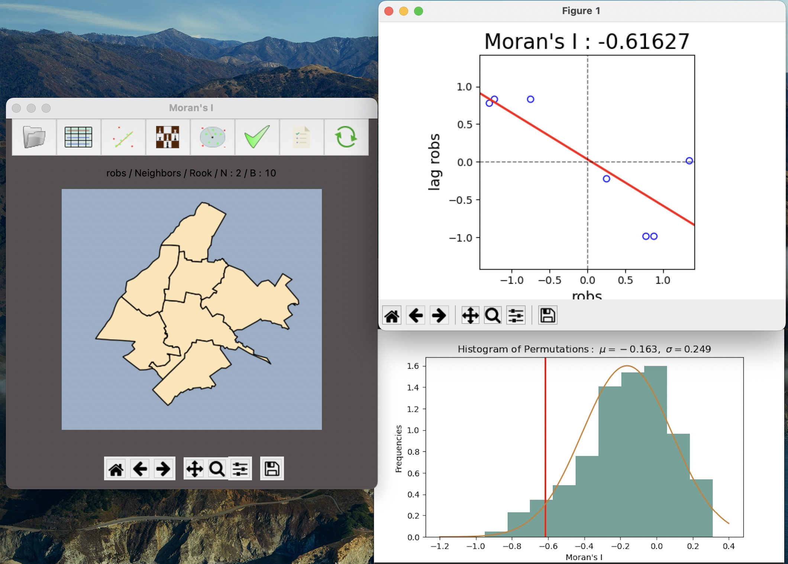

# MoransI Calculator

A scientific application which calculates the spatial autocorrelation index - Moran's I for a given shapefile.  
It detects outliers implements hypothesis testing using permutations and generates relevant graphs and reports.

# Install

pip install -r requirements.txt

# Usage

Insert a polygon shapefile and select relevant parameters to calculate Morans I
